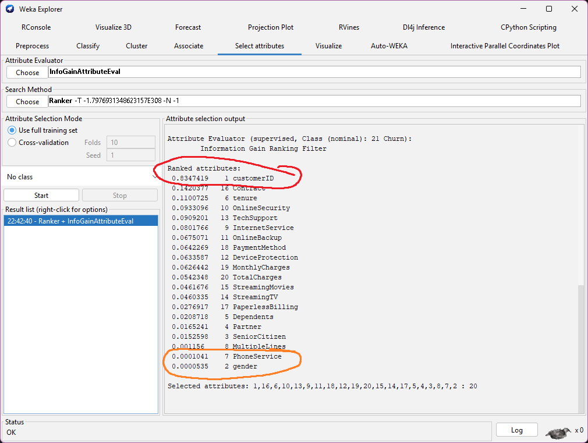
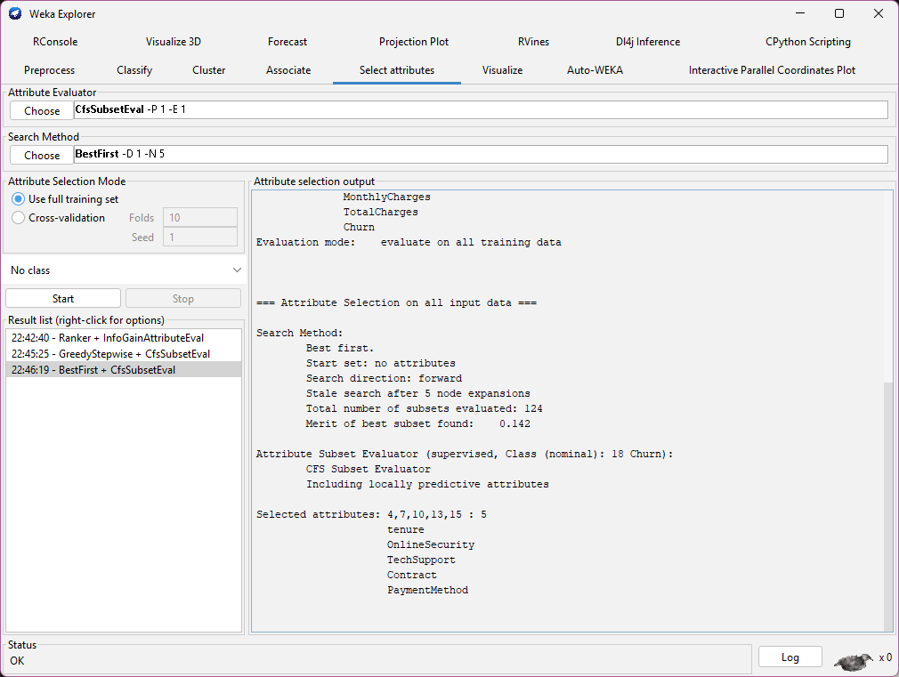
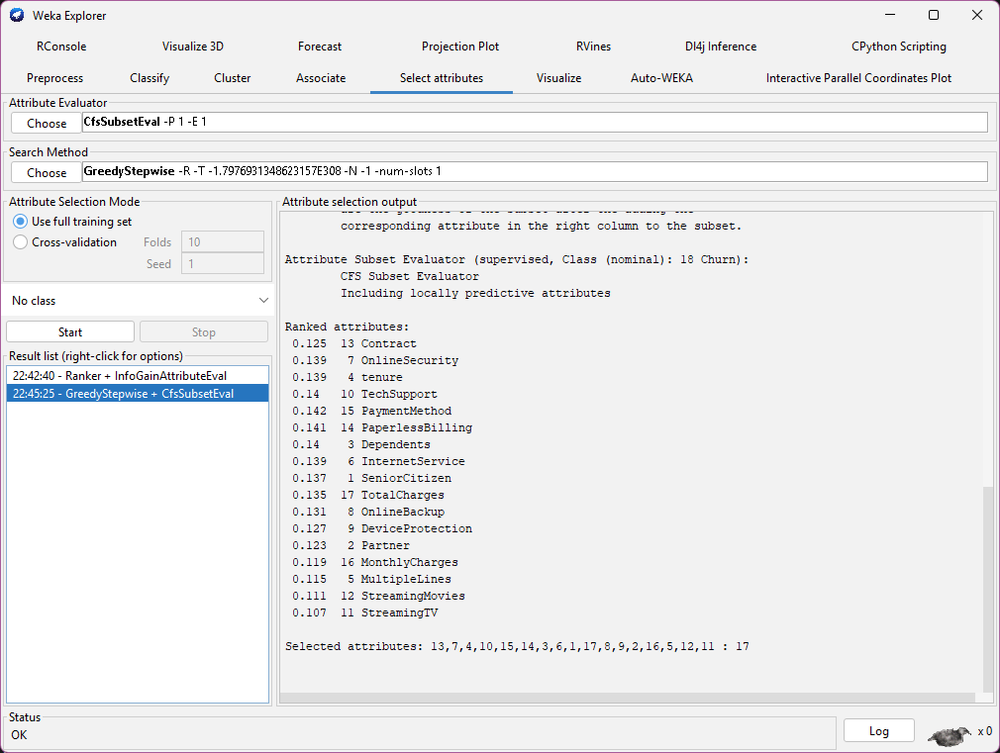
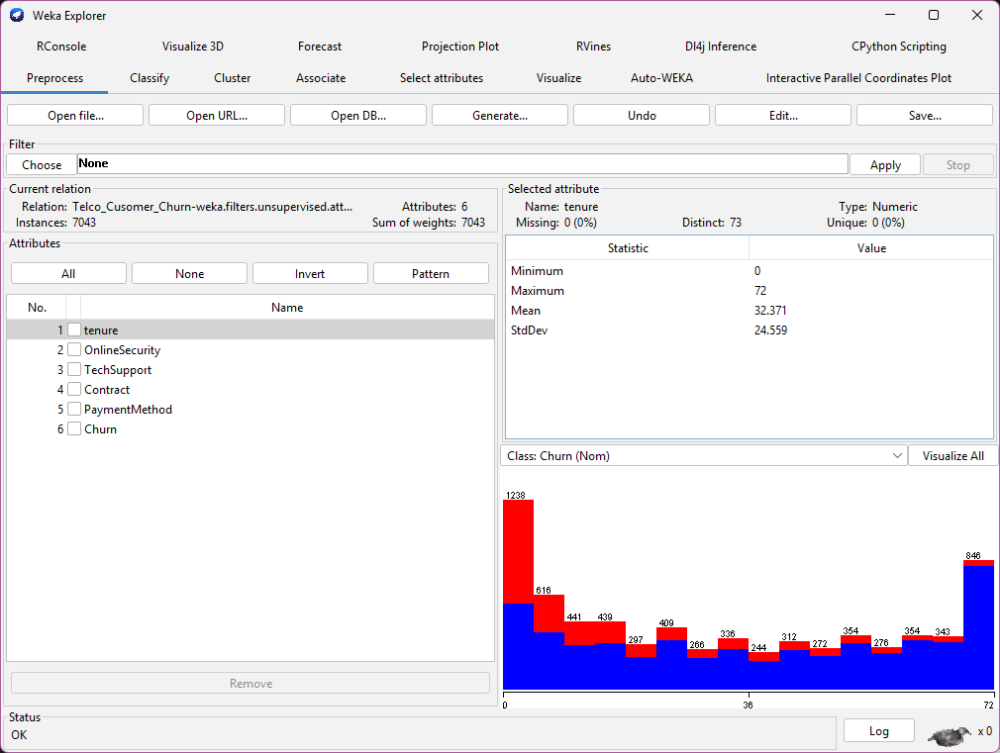
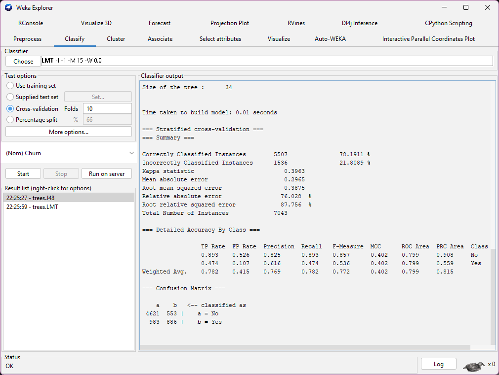
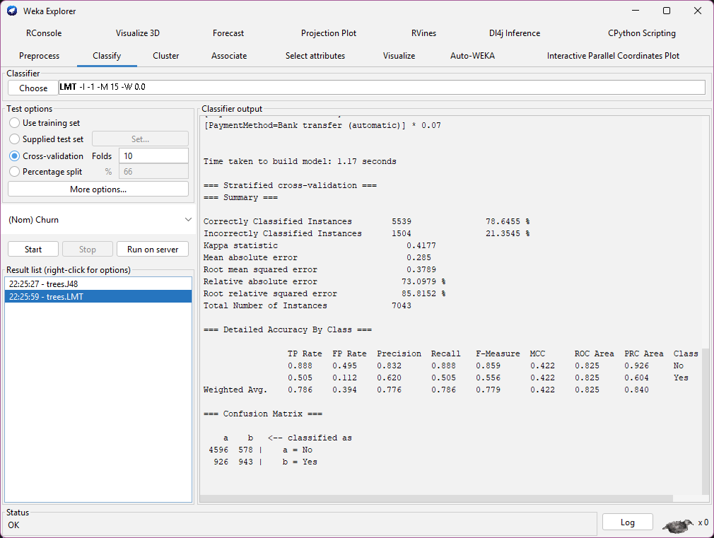
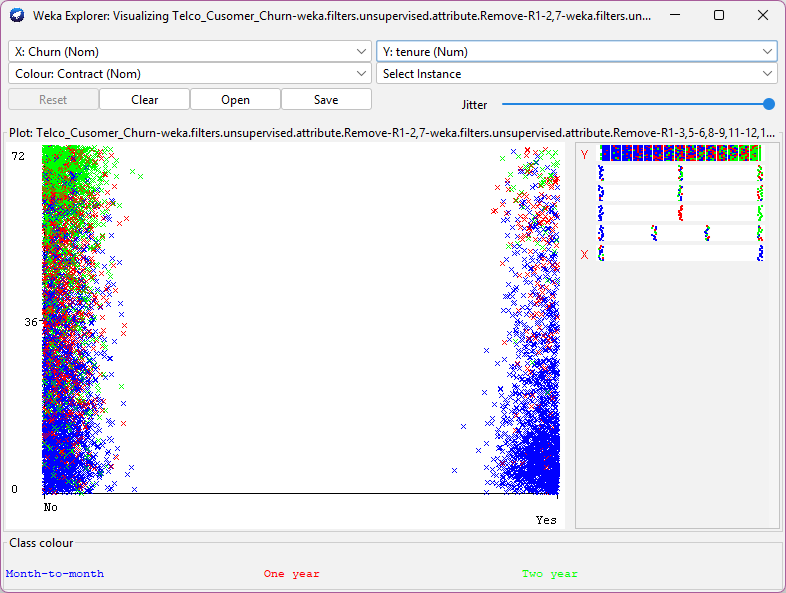
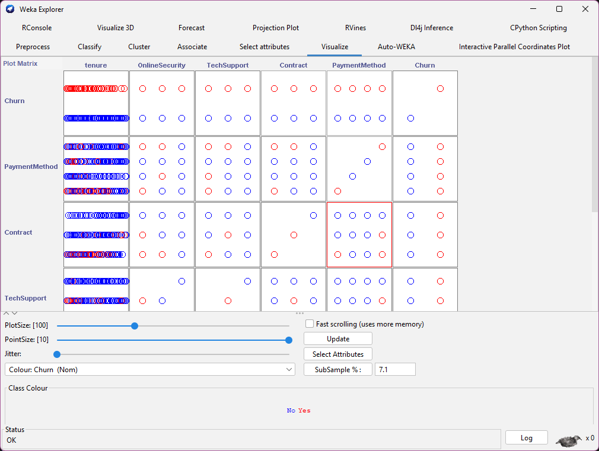

# Telco Churn Exploration (WEKA) — Notes & Findings

This document records an exploratory analysis performed in WEKA to understand **what factors influence customer churn** in a telco dataset.  
This README focuses on the WEKA exploration, feature selection steps, classifier comparison, and the main insights derived.

---

1) PROBLEM DEFINITION
---------------------
Goal:
  Identify which attributes most strongly influence whether a telco customer will **churn** (cancel subscription) or **stay**.  
  Use WEKA to evaluate attribute importance, select a reduced set of features, then compare classifiers.

Target / Class:
  - `Churn` (nominal: Yes / No)

Candidate attributes (examples from dataset):
  - tenure
  - OnlineSecurity
  - TechSupport
  - Contract
  - PaymentMethod
  - InternetService
  - MonthlyCharges
  - TotalCharges
  - PhoneService, MultipleLines, gender, customerID, etc.

---

2) FEATURE SELECTION — INFOGAIN (noisy & weak attributes)

---------------------------------------------------------
We ran InfoGainAttributeEval (rank attributes by information gain). Example output (higher = more informative):

 0.8347419    1 customerID  
 0.1420377   16 Contract  
 0.1100725    6 tenure  
 0.0933096   10 OnlineSecurity  
 0.0909201   13 TechSupport  
 0.0801766    9 InternetService  
 0.0675071   11 OnlineBackup  
 0.0642269   18 PaymentMethod  
 0.0633587   12 DeviceProtection  
 0.0626442   19 MonthlyCharges  
 0.0542348   20 TotalCharges  
 0.0461676   15 StreamingMovies  
 0.0460335   14 StreamingTV  
 0.0276917   17 PaperlessBilling  
 0.0208718    5 Dependents  
 0.0165241    4 Partner  
 0.0152598    3 SeniorCitizen  
 0.001156     8 MultipleLines  
 0.0001041    7 PhoneService  
 0.0000535    2 gender

Key observations from InfoGain:
- `customerID` (and other ID-like fields) have high or meaningless scores — candidate for removal (IDs leak nothing useful about behavior).
- Attributes with near-zero scores (`gender`, `PhoneService`, `MultipleLines`) are weak — likely noisy or irrelevant for churn in this dataset.
- Attributes like `Contract`, `tenure`, `OnlineSecurity`, `TechSupport`, and `PaymentMethod` show higher information gain and deserve deeper focus.

  

Action taken:
- Drop obviously noisy or irrelevant attributes (IDs, gender, phone service), and move to correlation-based selection next.
---

3) FEATURE SELECTION — CFS (Correlation-based subset)
-----------------------------------------------------
We used CFSSubsetEval (selects groups of attributes that are correlated with the target but not highly correlated with each other). We tried both GreedyStepwise and BestFirst search strategies.

Both returned the same subset:

Selected attributes:
  - tenure  
  - OnlineSecurity  
  - TechSupport  
  - Contract  
  - PaymentMethod  
  - (plus the target: Churn)

Interpretation:
  - These five predictors are the most relevant and least redundant for predicting churn in this dataset.
  - This reduction simplifies modeling and helps interpretability.

Decision:
  - We drop other attributes and proceed with modeling using these five predictors + target.

  

  

---

1) MODELING & COMPARISON
------------------------
We trained and evaluated multiple classifiers (10-fold stratified cross-validation). Two models performed best:

  

A) J48 (C4.5 decision tree) — summary:
=== Stratified cross-validation ===
=== Summary ===

Correctly Classified Instances        5507               78.1911 %  
Incorrectly Classified Instances      1536               21.8089 %  
Kappa statistic                          0.3963  
Mean absolute error                      0.2965  
Root mean squared error                  0.3875  
Relative absolute error                 76.028  %  
Root relative squared error             87.756  %  
Total Number of Instances             7043     

Detailed accuracy by class:
                 TP Rate  FP Rate  Precision  Recall   F-Measure  MCC      ROC Area  PRC Area  Class  
                 0.893    0.526    0.825      0.893    0.857      0.402    0.799     0.908     No  
                 0.474    0.107    0.616      0.474    0.536      0.402    0.799     0.559     Yes  
Weighted Avg.    0.782    0.415    0.769      0.782    0.772      0.402    0.799     0.815      

(Confusion matrix not fully pasted here by the tool; overall the recall for "No" is high, "Yes" is weaker.)

B) LMT (Logistic Model Tree) — summary:
=== Stratified cross-validation ===
=== Summary ===

Correctly Classified Instances        5539               78.6455 %  
Incorrectly Classified Instances      1504               21.3545 %  
Kappa statistic                          0.4177  
Mean absolute error                      0.285  
Root mean squared error                  0.3789  
Relative absolute error                 73.0979 %  
Root relative squared error             85.8152 %  
Total Number of Instances             7043     

Detailed accuracy by class:
                 0.888    0.495    0.832      0.888    0.859      0.422    0.825     0.926     No  
                 0.505    0.112    0.620      0.505    0.556      0.422    0.825     0.604     Yes  
Weighted Avg.    0.786    0.394    0.776      0.786    0.779      0.422    0.825     0.840      

Confusion Matrix:
    a    b   <-- classified as  
 4596  578 |    a = No  
  926  943 |    b = Yes

Interpretation:
  - LMT gives slightly better overall accuracy and better ROC area than J48.
  - LMT improves recall for the "Yes" class (churn) compared to J48 (0.505 vs 0.474), while keeping strong performance for "No".
  - LMT’s MCC and ROC metrics indicate a more balanced classifier.

Decision:
  - Choose **LMT** as the preferred model for this dataset.

  

  

---

5) LMT INSPECT — coefficients & interpretation
-----------------------------------------------
The LMT produced a logistic model (single leaf in this run). Key coefficients (excerpt):

LM_1:
Class No :
1.4  + 
[tenure] * 0.01 +
[OnlineSecurity=No] * -0.52 +
[OnlineSecurity=Yes] * -0.21 +
[OnlineSecurity=No internet service] * 0.1  +
[TechSupport=No] * -0.22 +
[Contract=Month-to-month] * -0.72 +
[Contract=One year] * -0.27 +
[Contract=Two year] * 0.1  +
[PaymentMethod=Electronic check] * -0.33 +
[PaymentMethod=Mailed check] * 0.03 +
[PaymentMethod=Bank transfer (automatic)] * -0.07

Class Yes :
-1.4 + 
[tenure] * -0.01 +
[OnlineSecurity=No] * 0.52 +
[OnlineSecurity=Yes] * 0.21 +
[OnlineSecurity=No internet service] * -0.1 +
[TechSupport=No] * 0.22 +
[Contract=Month-to-month] * 0.72 +
[Contract=One year] * 0.27 +
[Contract=Two year] * -0.1 +
[PaymentMethod=Electronic check] * 0.33 +
[PaymentMethod=Mailed check] * -0.03 +
[PaymentMethod=Bank transfer (automatic)] * 0.07

Notes on coefficients:
  - Positive coefficients in the "Yes" equation increase the probability of churn.
  - `Contract=Month-to-month` strongly increases churn probability (+0.72).
  - `Contract=Two year` slightly reduces churn (-0.10), i.e., it favors staying.
  - `Electronic check` increases churn risk (+0.33).
  - `No` for OnlineSecurity and TechSupport increase churn risk.
---

6) BUSINESS INSIGHT / INTERPRETATION
------------------------------------
- Contract type is a dominant factor: **month-to-month customers are far more likely to churn**; two-year customers are much less likely to churn.
- Even in an adverse profile (tenure = 0, no security, no tech support, payment = electronic check), a two-year contract still leans the model toward predicting **STAY**.  
  - This suggests the dataset contains strong evidence that long-term contracts are associated with retention (sunk-cost, penalties, or selection effects).
- Other actionable factors:
  - Improve TechSupport and OnlineSecurity offerings for at-risk customers.
  - Review payment method friction (electronic check correlation with churn).

---

## Tenure and Contract Length Analysis

We can also see in the graph that a lot of customers around **60–70 months of tenure** tend to use a **2-year subscription**.  
These customers are staying subscribed and are not churning.  

This observation suggests:

- The **longer a customer stays**, the more likely they are to afford or choose a **2-year contract**.  
- Customers with higher tenure and longer contracts are **much less likely to churn**.  

  

  

----

7) LIMITATIONS & CAUTION
------------------------
- Dataset bias: If the dataset contains structural biases (e.g., two-year contracts historically used by low-churn segments), the model learns that pattern; it's not causal proof.
- Class imbalance & recall: Even with LMT, recall for "Yes" is ~0.505 — not perfect. Consider cost-sensitive learning or additional data.
- Feature encoding & order: When deploying, make sure input attributes are in the exact order and nominal encodings match training.

---

8) NEXT STEPS (My actual application)
---------------------------
- I added a source project for Java Application.
- This project contains the application of the model coded in Java language as per WEKA language.
- Features included are 2 entries. Either manual or by dataset. Wherein datasets must follow the correct format of attributes.

---

END
---
This file documents the WEKA exploration and the reasoning behind choosing the LMT model for telco churn prediction as per my learning purposes. Thank you for taking the time reading this.